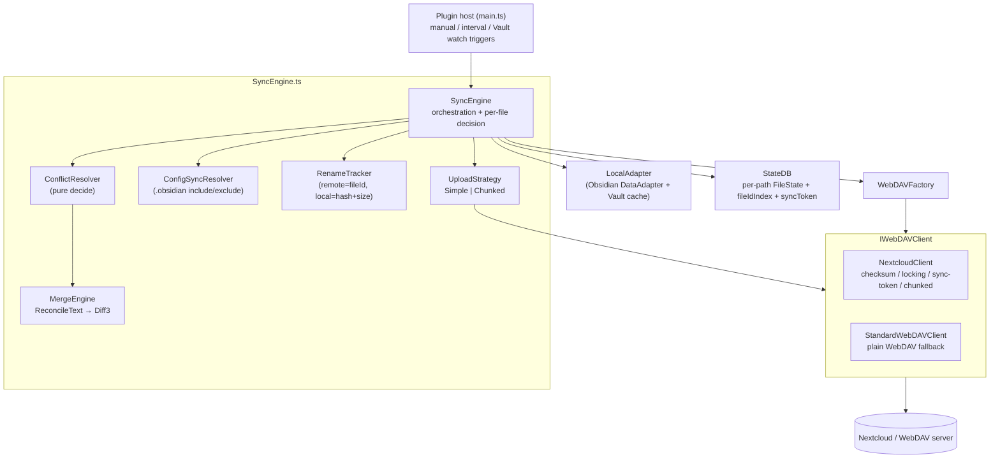
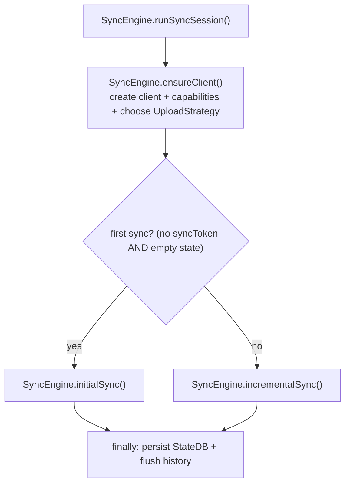
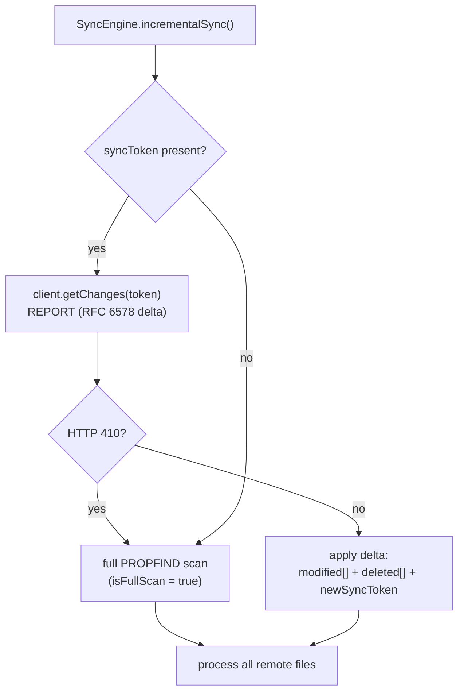
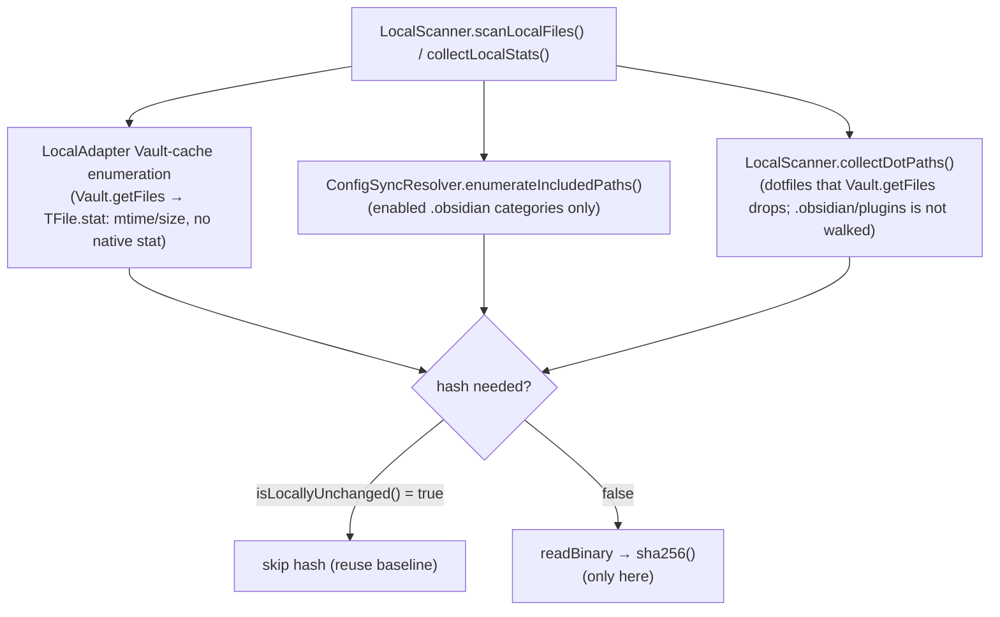
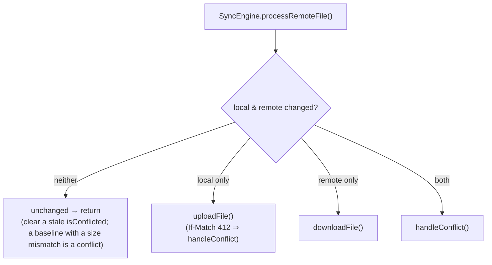
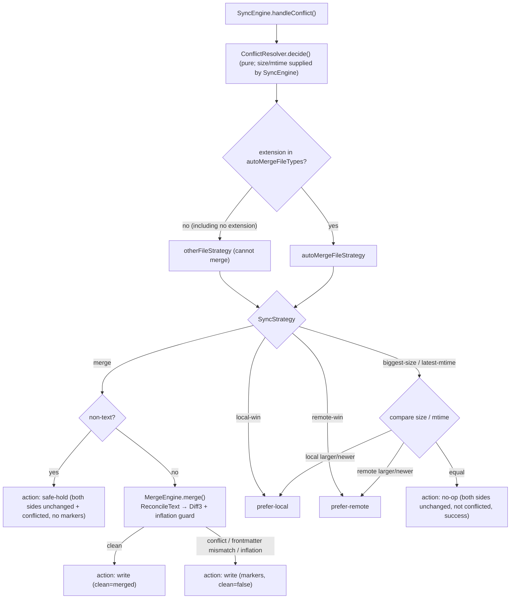
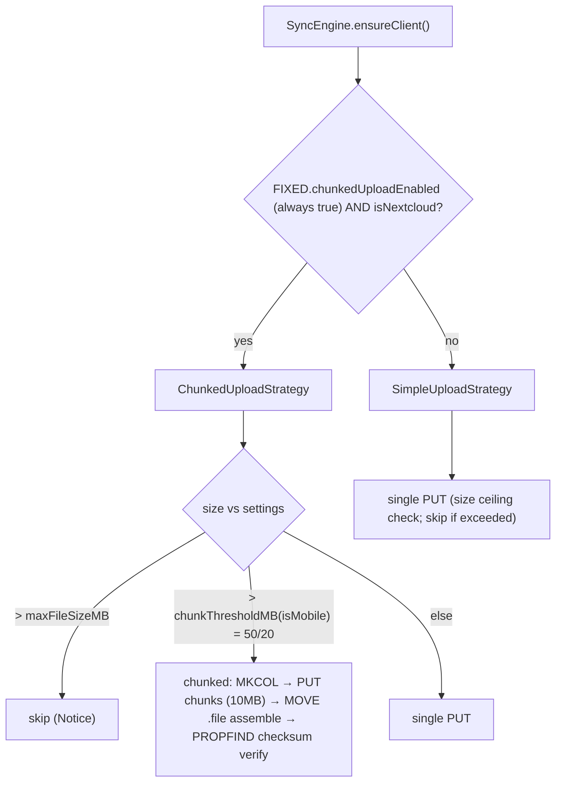
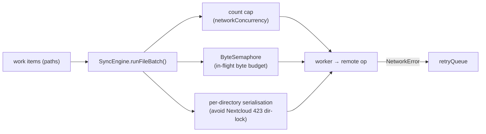
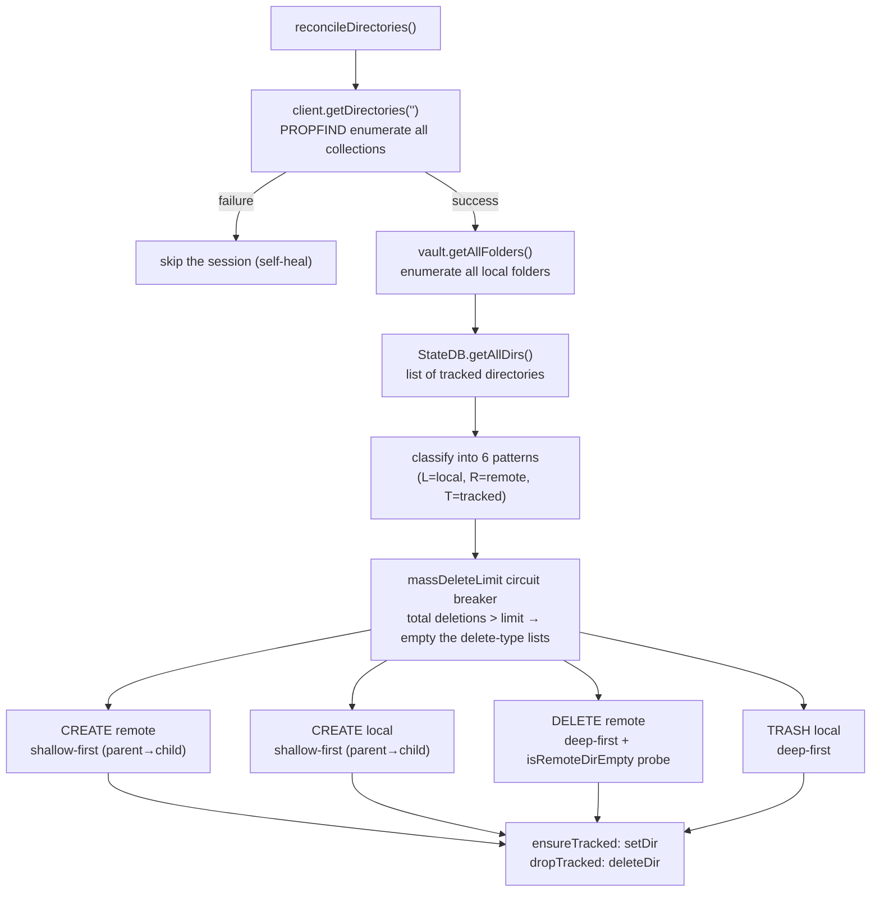
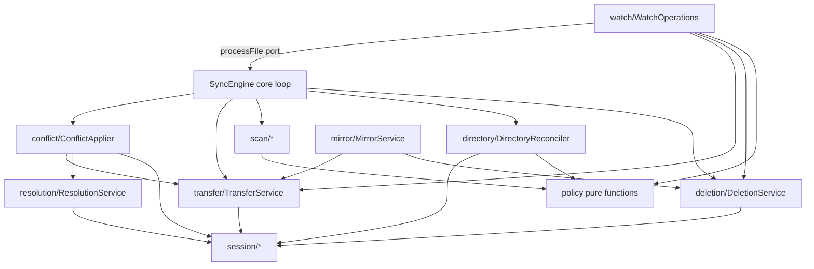

# Nextcloud Sync — Implementation design

This document describes the structure of the current implementation: how the sync engine is built and why each part sits where it does. The behavioural source of truth is docs/spec.md; this document is the reference for fixing logic and locating bottlenecks.

Function and method names are the stable anchors. The central file is [`src/sync/SyncEngine.ts`](../src/sync/SyncEngine.ts); the decision order of the phases and the decision conditions are the stable contract.

## §1. Components



| Concern | Location |
|---|---|
| Orchestration, per-file decision | `SyncEngine.ts` |
| Server capability detection, PROPFIND/REPORT, PUT/MOVE/LOCK | `network/NextcloudClient.ts`, `StandardWebDAVClient.ts` |
| Pure conflict decision (no I/O) | `sync/ConflictResolver.ts` |
| Text / frontmatter merge | `sync/merge/*` (ReconcileText → Diff3) |
| Rename detection | `sync/RenameTracker.ts` |
| `.obsidian` include/exclude (category opt-in) | `sync/ConfigSyncResolver.ts` |
| Upload selection (Simple/Chunked) | `sync/upload/*` |
| Local FS + Vault cache enumeration | `data/LocalAdapter.ts` |
| Persisted per-file state and sync token | `data/StateDB.ts` |
| Tuning constants | `util/limits.ts` |

## §2. Entry points and triggers

The full sync lives in `SyncEngine.ts`. The six watch operations (sync on file change) live in `src/sync/watch/WatchOperations.ts`; the methods of the same names on `SyncEngine` only delegate.

| Trigger | Method | Scope |
|---|---|---|
| Manual button / interval timer / startup / foreground resume | `SyncEngine.syncManual()` → `SyncEngine.runSyncSession()` | Full session |
| Vault `create` / `modify` (file) | `WatchOperations.syncSingleFile(path)` | One file. Fetches the remote with `statFile`, then decides upload / download / conflict resolution with the same `processFile` classifier the full sync uses (a file missing on the remote is uploaded as new) |
| Vault `delete` (file) | `WatchOperations.deleteSingleFile(path)` | One file, remote delete |
| Vault `rename` (file) | `WatchOperations.renameSingleFile(old,new)` | One MOVE (`RenameTracker`) |
| Vault `create` (folder) | `WatchOperations.createSingleFolder(path)` | MKCOL |
| Vault `delete` (folder) | `WatchOperations.deleteSingleFolder(path)` | Remote folder delete |
| Vault `rename` (folder) | `WatchOperations.renameSingleFolder(old,new)` | One MOVE |

- **Balking guard**: if `this.running` is set, `syncManual` returns immediately. There is only ever one full session.
  The running promise is held in `currentRun` so that `abortAndWait()` can join it. Watch operations do not
  run during a full sync; they push the path onto a pending set and re-evaluate it after the full sync ends.
- **Wi-Fi gate**: `SyncEngine.isBlockedByWifiOnly()` (which calls `isCellularBlocked`; it blocks only when
  `navigator.connection.type === 'cellular'`, a fail-open check. iOS has no such API and is never blocked; desktop does not
  expose the type, so the gate is effectively off there) short-circuits the full sync.
  **Each of the six watch operations also makes the same check at entry**; while blocked it leaves a single log line and returns
  with no side effects (`skippedOnCellular`; the change is not pushed onto the retry queue or the pending set). A skipped
  change is picked up by the next full sync's difference detection.
- Each of the six watch operations calls `isSystemExcluded()` first, so excluded targets (the config folder,
  the active log, tmp files) are not synced through the watcher either (the Wi-Fi gate comes right after). For the two rename
  operations the early return applies only when both the old and the new path are excluded.

## §3. Orchestration



- `ensureClient()` runs once only. It creates the client (Nextcloud, falling back to Standard on failure), reads the
  capabilities, and chooses the upload strategy (**Simple or Chunked only; see §10**).
- First-sync check: an empty sync token **and** an empty StateDB → `initialSync()`; anything else → `incrementalSync()`.
- `finally` always persists state and flushes history. The failure of one file never stops the whole session.
  (Per-device logging is carried by the debug log lines of each `SyncEngine` operation. The structured sync log `SyncLogWriter` has been removed; see §12.)

## §4. Change-detection strategy



- **Incremental (light)**: `getChanges(token)` returns only the changed/deleted paths and the new token. It does not walk the whole tree.
  The token is stored in StateDB.
- **Token expiry (410)** → `SyncTokenExpiredError` → fall back to a **full PROPFIND** (`isFullScan=true`
  enables absence-based remote-delete detection; see §7.5).
- **Plain WebDAV** does not support the sync-collection REPORT → always a full scan (recursive Depth:1).
- Retry queue: items that failed last time are reprocessed at the **start** of the next incremental sync.

## §5. Remote scan

| Path | Method | Notes |
|---|---|---|
| Full (Nextcloud) | `NextcloudClient.getFiles()` | PROPFIND `Depth: infinity`. **A 404 on the root ⇒ `RemoteRootMissingError`** (the vault folder itself is missing, which triggers the re-seed in §7.5; only the first sync reads it as an empty listing); a 404 on a subpath ⇒ empty |
| Full (Standard) | `StandardWebDAVClient.getFiles()` | Recursive `Depth: 1` DFS with a cycle guard. **Only a 404 at the top level is `RemoteRootMissingError`**; a 404 on a subfolder during recursion is an empty subtree |
| Delta | `NextcloudClient.getChanges(token)` | REPORT; 410 ⇒ expired |
| Checksum completion | `RemoteListingSource.resolveRemoteChecksums()` → `NextcloudClient.recalcChecksum()` | Server-side SHA-256 computation (no download), best-effort, with a concurrency cap |

`RemoteFileInfo = { path, fileId, checksum, etag, size, lastModified }`. `fileId` (oc:fileid) drives remote
rename detection, and `checksum` (when present) decides whether a transfer of an identical file can be skipped.

XML parsing yields to the event loop every `PARSE_YIELD_EVERY = 100` entries so that large vaults do not freeze the UI.

## §6. Local scan and hashing



- **Enumeration uses the Vault's in-memory index** (`Vault.getFiles` / `LocalAdapter.listVaultFiles()`) and
  avoids a native `stat` per file (the main reason mobile is fast). Dotfiles that the index drops are
  re-enumerated through the adapter, but `.obsidian/plugins` is not walked (hard-exclude).
- **Hashing is the heaviest step and is avoided as far as possible.** `isLocallyUnchanged()` skips the hash when the stored **stat signature**
  (`localMtime` + `localSize`) equals the current stat. However, if the mtime is within
  `SIGNATURE_SAFETY_WINDOW_MS = 2000ms` of "now" or of the "last sync" (a filesystem-granularity guard), the file is hashed once and the
  signature is regenerated.
- In the initial plan, files larger than `MAX_HASH_SIZE = 20MB` are **not** hashed. They go straight to conflict
  resolution (a mobile OOM guard).

## §7. Per-file decision (four quadrants)

`SyncEngine.processRemoteFile()` classifies each remote file with two booleans:

- `remoteChanged = !base || base.remoteId !== (remote.checksum ?? remote.etag ?? String(size))`
- `localChanged`  = the local stat exists **and** (`!isLocallyUnchanged` → the hash differs). If the local
  stat is missing ⇒ local deletion → `applyLocalDeletion()`.



**Identical content is checked before the four-quadrant decision.** When the local file exists and either side is marked changed,
the engine compares sizes and then the server checksum against the local hash (the local hash is the freshly computed one, or
`base.localHash` when the stat signature matched and the file was not read). If they match, the file is recorded as converged
(`convergedState()` plus the current stat signature) and nothing is transferred, whatever the baseline says. An ETag or a size alone never
proves identity; only the SHA-256 does. The decision table (local file present):

| Baseline present? | Stat signature | Remote changed | Local changed | Checksum and size match | Result |
|---|---|---|---|---|---|
| no | n/a | yes | yes | yes | Record convergence; no transfer |
| no | n/a | yes | yes | no | `handleConflict()` |
| yes | matches (file not read) | yes | no | yes | Record convergence; no read, no transfer |
| yes | matches (file not read) | yes | no | no | `downloadFile()` |
| yes | differs (file read) | yes | yes | yes | Record convergence; no transfer |
| yes | differs (file read) | yes | yes | no | `handleConflict()` |
| yes | differs (file read) | no | yes | yes | Record convergence; no transfer |
| yes | differs (file read) | no | yes | no | `uploadFile()` (unchanged) |
| yes | either | no | no | n/a | Unchanged behaviour (a size mismatch goes to `handleConflict()`, otherwise nothing happens) |

### §7.4 Upload, download and delete

The `SyncEngine` methods below delegate to extracted services (see §17); the behaviour is described at the level of the operation.

- **`uploadFile()`** (`TransferService.uploadFile()`) — stat → readBinary → `acquireLock()` (when Files Locking is in use) →
  `uploadStrategy.upload(client, path, data, mtime, {ifMatchEtag})` → `releaseLock()` →
  `setFile(withLocalSignature(...))` → history `uploaded`. `FileLockedError` (423) ⇒ retry queue.
- **`downloadFile()`** (`TransferService.downloadFile()`) — `client.downloadFile()` → `atomicWriteBinary()` → `setMtime(remote)` →
  `sha256` → `setFile(withLocalSignature(...))`. **A fetched body that equals the local file is not written**: the state is recorded as
  converged, and there is no write, no `setMtime` (the mtime stays, so no vault event fires), no history entry and no download count.
- **Local deletion** `applyLocalDeletion()` (`DeletionService.applyLocalDeletion()`) — confirmed with the server checksum. Baseline match ⇒ delete the remote
  (to the trash); divergence ⇒ **restore** to local (the remote edit is not lost); no checksum ⇒ skip (the safe side).
- **Remote deletion** `processRemoteDeletion()` (`DeletionService.processRemoteDeletion()`) — **a security boundary**: `isSystemExcluded()` comes first
  (a malicious server cannot make the client delete config / plugins / the active log) → Vault trash / raw remove →
  `deleteFile()`.

`processRemoteDeletion()` returns a `RemoteDeletionOutcome` (`DeletionService.ts`), so a caller that must report failures (the mirror, §18.3)
can tell what happened:

| `status` | Meaning |
|---|---|
| `deleted` | The local file or folder was removed (Vault trash or raw remove) |
| `absent` | There was nothing locally to remove |
| `ignored` | The path is system-excluded; nothing was touched |
| `failed` (with `message`) | The removal threw; the user was notified |

An ordinary sync uses the return value for one thing only: when the removal `failed`, `SyncEngine.processRemoteDeletion()` clears the stored root ETag. The entry kept for the retry describes a file the server no longer has, and a short-circuited scan would rebuild the remote listing from State, see that file as still on the server and never retry. What the user sees is unchanged (the wrapper still returns `void`).

### §7.5 Renames and absence deletes

- **Remote rename**: `RenameTracker.detectRemoteRenames()` maps `oc:fileid` to the destination path
  (O(1) through `fileIdIndex`).
- **Local rename**: `detectLocalRenamesByHash()` matches "paths that are in StateDB but gone locally" against new
  local files by **hash+size** → `applyLocalRename()` issues a WebDAV `MOVE` (Overwrite:F; 412 ⇒
  ConflictError, swallowed).
- **Absence delete on a full scan** (in `SyncEngine.processLocalModifications()`): a tracked path that exists neither locally nor remotely
  is a deletion candidate, but if the number of candidates exceeds `Math.max(20, floor(tracked*0.2))` a **circuit
  breaker** skips them (preventing mass false deletion from a partial or failed listing). Before a candidate is confirmed it is re-checked
  with `remoteExists` (PROPFIND) for a 404.
- **Absence deletes run even when the remote listing is empty** (issue #50). The old `remotePathSet.size > 0`
  guard has been removed, and the defence is only the two stages above (the breaker plus the `remoteExists` re-check). A failure to fetch the listing
  raises an exception, so "failure = empty array" cannot happen. For the details and the reason the old guard existed, see docs/spec.md §8.
- **If the vault folder itself is missing (root 404), the engine re-seeds instead of deleting.** Only when the `createVaultRoot()`
  MKCOL **returns 201 (it really did not exist)** does it call `StateDB.reset()` and take the first-sync path, uploading every local
  file and issuing MKCOL for every local folder (zero local deletions). **On 405 (it actually exists) or on failure it performs
  no destructive operation at all**, records the error, and leaves the matter to the next real scan. A first sync (empty State) behaves as before.

## §8. Conflict resolution

File kind → a single `SyncStrategy` through a single dispatch. The dedicated newest-wins branch for the config folder has been removed; `json` files are resolved through the Other File / `latest-mtime` path.



Action execution on the `SyncEngine` side (implemented in `ConflictApplier`):

| Action | Method | Effect |
|---|---|---|
| `write` | `resolveByWrite()` | Writes the merged / marker content to local, applies the `max(local,remote)` mtime, and **pushes the merge result to the server** to converge. History is `merged` (clean) / `conflicted` (markers) |
| `prefer-local` | `resolveByPreferLocal()` | Overwrites the remote with local. If the upload fails, the conflict is kept and a retry is queued |
| `prefer-remote` | `resolveByPreferRemote()` | Overwrites local with the remote bytes and keeps the remote mtime |
| `safe-hold` | inline | Non-text × merge. Touches neither side and sets `isConflicted=true` (no markers, zero corruption; FR-005a). No error is counted and no retry is made |
| `no-op` | inline | A tie (equal size/mtime). Touches neither side; not conflicted and not an error (FR-009). StateDB is unchanged, so it is re-evaluated next time |

MergeEngine circuit breakers: (1) the conflict-region count exceeds `maxConflictRegions` (**fixed at 0 = unlimited**, so it does not fire in practice; guarded by `!== 0 &&` in `MergeEngine.ts`); (2) the merged length is under 50% of `max(local,remote)` (a content-loss guard, always active); (3) the **inflation guard (FR-005b)**: a clean candidate longer than the sum of both input bodies, or containing a run of two or more duplicated lines, is demoted to a conflict (a countermeasure for the reconcile duplication bug that comes from an empty base; the reconcile clean path only). A frontmatter mismatch is always treated as a conflict (markers).

`ConflictApplier.handleConflict()` runs its steps in this order:

1. **Size limit** — a remote over the size limit is counted as a conflict encounter, flagged and returned.
2. **Identity check** — `convergeIfIdentical()` reads the local file and hashes it. With a server checksum, the checksum decides.
   Without one, and only when the sizes match, the remote body is fetched and compared byte for byte. If identical, the state and the
   merge base are recorded as converged and the method returns: no summary count, no history entry, no write, no upload and
   no conflict-encounter count. A body fetched for this comparison is **reused** by the later merge branch instead of being downloaded again.
3. **Conflict-encounter count** — only a real conflict is counted.
4. **Decision** — `ConflictResolver.decide()` and the action execution below.

Markdown assembly goes through `splitMarkdown()` / `joinMarkdown()` in `MergeEngine`. `splitMarkdown()` returns the raw frontmatter block
(everything up to `contentStart`, both fences and the closing fence's line terminator included), the inner frontmatter text, `lead` (the
whitespace between the block and the body) and the body. Frontmatter equality is decided on the inner text, and an equal frontmatter keeps the local
raw block byte for byte. The invariant is `fm + lead + body` equals the input for any input; `joinMarkdown(fm, lead, body)` puts the
merged parts back together, adding a line break only when the block does not already end with one. `lead` follows the side that differs from the base (local when both differ).

## §9. Settings that change the algorithm

| Setting | Effect on the algorithm |
|---|---|
| `autoMergeFileTypes` | Classifies non-markdown extensions. In the list = Auto Merge File (`autoMergeFileStrategy`); otherwise Other File (`otherFileStrategy`). Empty = everything is Other File. Markdown (`md`) is always special-cased regardless of the list |
| `frontmatterStrategy` | Strategy for markdown frontmatter (default `merge`). The body follows `autoMergeFileStrategy` |
| `conflictStrategy` | Handling of a conflict the 3-way merge cannot solve (default `conflict-markers` = markers on both sides) |
| `autoMergeFileStrategy` | Strategy for Auto Merge Files (`merge`/`biggest-size`/`latest-mtime`/`local-win`/`remote-win`) |
| `otherFileStrategy` | Strategy for Other Files (the 4 values other than `merge`) |
| `FIXED.maxConflictRegions` | Merge circuit breaker (fixed at 0 = unlimited; never fires) |
| `FIXED.chunkedUploadEnabled` | Chunked or Simple (fixed on; Nextcloud only) |
| `chunkThresholdMB(isMobile)` / `maxFileSizeMB` | Chunk threshold (fixed: 50 desktop / 20 mobile) / forced-skip ceiling |
| `FIXED.fileLockingEnabled` | Fixed off (no LOCK/UNLOCK is issued; If-Match is the lost-update defence) |
| `networkConcurrency` | Cap on parallel workers (§11) |
| `syncConfigFolder` + `configSync.*` | Which `.obsidian` categories are in scope |
| `loggingEnabled` | While ON, this device's own log is excluded from sync (`isActiveOwnLog`; this setting replaces the former `debugLogEnabled` / `syncLogEnabled`) |
| `massDeleteLimit` | Ceiling of the mass-delete breaker (`-1` = automatic dynamic limit / `0` = unlimited / `N` = fixed; `effectiveMassDeleteLimit`) |
| `syncOnWifiOnly` | When ON and the connection is cellular, short-circuits the full sync and the six watch operations (the Wi-Fi gate in §2) |
| `watchOnChangeEnabled` | Gate for whether each vault event starts the six watch operations (common to all platforms; the first-run default on mobile is OFF) |

The `FIXED` constants and `chunkThresholdMB` are defined in `src/util/fixedSyncConfig.ts`.

## §10. Upload strategy



- **Single PUT** (`NextcloudClient.uploadFile`): `OC-Checksum` + `X-OC-MTime` + an optional `If-Match`
  (optimistic concurrency control → 412 ⇒ conflict). Directory creation is reactive: PUT first, and on `409` the parent is
  MKCOLed and the PUT is retried once (a `createdDirs` cache avoids repeated MKCOL).
- **Chunked** (`NextcloudClient.uploadChunked`): `CHUNK_SIZE_BYTES = 10MB`, assembled with `MOVE .file`, checksum verified after
  assembly, and on failure it falls back to a single PUT.
- **Bulk upload is not wired into the upload path.** `hasBulkUpload` is *detected* from the capabilities
  (`dav.bulkupload`), but the strategy selector returns only Simple or Chunked, and no bulk threshold constants or
  `bulkUploadEnabled` setting exist in `src/`. Treat bulk as a hook for the future.

## §11. Concurrency and memory budget



- **Count cap**: `networkConcurrency` (the default follows RAM: `≥8GB→16`, `≥4GB→8`, otherwise `4`, unknown/iOS →
  `3`; `resolveConcurrencyDefault()`).
- **Byte cap**: `ByteSemaphore` (`src/util/ConcurrencyLimiter.ts`) limits the total in-flight bytes to `MAX_INFLIGHT_BYTES_DESKTOP = 100MB` /
  `MAX_INFLIGHT_BYTES_MOBILE = 30MB` (because Obsidian's `requestUrl` buffers the whole body in memory). A huge
  file is clamped to occupy the budget alone (deadlock avoidance).
- **Per-directory serialisation** prevents simultaneous writes into the same folder (a Nextcloud directory lock returns
  423).

## §12. State (StateDB)

`FileState = { path, localHash, remoteId, idType('sha256'|'etag'|'size'), size, mtime,
remoteFileId, isConflicted, localMtime?, localSize?, remoteMtime? }`.

- `localMtime`/`localSize` = the **stat signature** that backs the no-hash fast path (§6).
- `remoteId` + `idType` express how "did the remote change" is decided (checksum > etag > size).
- `fileIdIndex` (remoteFileId → path) makes rename detection O(1).
- **Atomic write** to `<pluginDir>/state-<deviceId>.json` (tmp → remove → rename), serialised by a save mutex. In watch mode
  saves are **debounced** (`requestSave`, about 2000ms) and force-flushed at the end of a session.
  StateDB also holds the `syncToken` for incremental sync.
- **`directories`**: holds a map of `DirState = { path, remoteFileId: string|null }`.
  This is directory tracking independent of files (see §16). For backward compatibility with old state (pre-DP),
  `load()` applies `if (!this.state.directories) this.state.directories = {}`.
  Read through `getDir / setDir / deleteDir / getAllDirs`.
- **Mirror persistence**: the mirror's `persist` saves, in this order, the state DB, the merge bases (flush) and the history. It runs in a
  `finally`, so it also runs when some items failed; a failed save is appended to the result's errors instead of being thrown, so the result is not shown as a success.
- `SyncSessionSummary` aggregates the counts (uploaded/downloaded/deleted/merged/conflicted/error) + `retriedFiles`
  + `errors[]` and is reflected in the Sync Status dialog and the debug log.

## §13. Errors, retries and cancellation

| Error | Handling |
|---|---|
| `NetworkError` | Record a per-file error + add to `retryQueue`. The session continues |
| `PreconditionFailedError` (If-Match 412) | Promoted to a conflict (download + resolve). A lost-update overwrite is never made |
| `ConflictError` (MOVE 412) | The rename target already exists → swallowed (log only) |
| `FileLockedError` (423) | Lock retry (bounded) → retry queue |
| `SyncTokenExpiredError` (410) | Fall back to a full PROPFIND |
| `FeatureUnsupportedError` | Graceful degradation (for example, versions on plain WebDAV) |

Cancellation has two phases: `requestStop()` sets `cancelled` (queued workers become no-ops), and
`abortAndWait()` joins `currentRun` before a maintenance reset. `finally` always persists state and history.

## §14. Where the bottlenecks are

| Hotspot | Cost | Existing mitigation | Tuning / risk |
|---|---|---|---|
| **Local hashing** | CPU + reading every file | Stat-signature fast path (`isLocallyUnchanged`), the initial plan's `MAX_HASH_SIZE` skip | The `SIGNATURE_SAFETY_WINDOW_MS` guard re-hashes right after a write; frequent edits re-hash |
| **Full PROPFIND scan** | XML for the whole tree, O(N) | Incremental token preferred, `PARSE_YIELD_EVERY` keeps the UI responsive | Every token expiry (410) falls back to a full scan; plain WebDAV is always full + recursive Depth:1 |
| **Per-file round trips** | upload PUT(+MKCOL), download GET, conflict GET+PUT, lock LOCK/UNLOCK, chunked MKCOL+N·PUT+MOVE+PROPFIND | Count + byte concurrency caps | Many small files ⇒ many round trips (bulk batching is not active; §10) |
| **In-flight memory** | `requestUrl` buffers the whole body | `ByteSemaphore` (100MB/30MB) | Large files serialise; a huge file blocks others while in flight |
| **Checksum completion** | Extra server calls on the first sync | Best-effort with a concurrency cap | A server without `recalcChecksum` ⇒ every file goes through conflict resolution |
| **Absence-delete re-check** | One PROPFIND per candidate (full scan) | `max(20, 20% of tracked)` circuit breaker | A mass delete is skipped by the breaker |
| **StateDB save** | JSON write of the whole map | Debounce + atomic + mutex | A huge vault serialises a large payload on every flush |

## §15. Constants (src/util/limits.ts)

| Constant | Value | Purpose |
|---|---|---|
| `MAX_HASH_SIZE` | 20 MB | Skip hashing large files in the initial plan |
| `SIGNATURE_SAFETY_WINDOW_MS` | 2000 ms | Freshness guard for the stat signature |
| `MAX_INFLIGHT_BYTES_DESKTOP` / `_MOBILE` | 100 MB / 30 MB | `ByteSemaphore` budget |
| `CHUNK_SIZE_BYTES` | 10 MB | Chunk size for chunked upload (**a private constant in `src/sync/upload/ChunkedUploadStrategy.ts`, not in `limits.ts`**) |
| `PARSE_YIELD_EVERY` | 100 | Event-loop yield during XML parsing |
| Bulk thresholds | none | The former bulk-upload size thresholds no longer exist; only the `hasBulkUpload` capability detection remains (§10) |
| Default concurrency | RAM-linked 16/8/4; 3 when RAM is unknown | Initial default of `networkConcurrency` |

Two more constants live in the same file: `FORCE_FULL_SCAN_EVERY = 20` (after that many consecutive root-ETag short-circuited full scans, a real full scan is forced) and `MASS_DELETE_MIN = 20` / `MASS_DELETE_FRACTION = 0.2` (floor and fraction of the tracked set used by `massDeleteLimit()`).

## §16. Directory sync

### §16.1 Basic policy

Directories are tracked in `StateDB.directories` as **first-class entities**, symmetric with files (see §12).
The "delete when there are zero child files" heuristic is not used — an empty directory is kept and synced.

Four methods were added to the client interface (`IWebDAVClient`):

| Method | Purpose |
|---|---|
| `getDirectories(basePath)` | Enumerate every collection (directory) under the vault root with PROPFIND |
| `isRemoteDirEmpty(path)` | Confirm with a Depth:1 PROPFIND that the remote is empty (a probe before deletion) |
| `deleteCollection(path)` | WebDAV DELETE (for collections only) |
| `createDirectory(path)` | MKCOL |

### §16.2 Orchestration of reconcileDirectories

`DirectoryReconciler.reconcileDirectories()` (called through `SyncEngine.reconcileDirectories(summary)`) is called only on a full scan
(the token-delta path cannot treat absence as deletion).



**Classification rules for the 6 patterns:**

| L | R | T | Result |
|---|---|---|------|
| yes | no | no | `mkcolRemote` — created locally (including an empty dir) |
| no | yes | no | `mkdirLocal` — created on another device |
| no | yes | yes | `deleteRemote` — deleted here → remote DELETE |
| yes | no | yes | `trashLocal` — deleted on another device → local trash |
| yes | yes | * | `ensureTracked` — present on both sides → keep tracking |
| no | no | yes | `dropTracked` — vanished → drop tracking |

### §16.3 Safety constraints

- **Operation order**: CREATE is shallow-first (parents first), DELETE is deep-first (children first).
- **Data-loss-prevention probe**: just before `deleteCollection()`, `isRemoteDirEmpty()` is called, and if the directory is not empty
  the engine `continue`s (leaving it to self-healing).
- **Circuit breaker**: `deleteRemote.length + trashLocal.length > massDeleteLimit(denom)` refuses the
  bulk delete. The denominator is normalised as `denom = max(tracked, remoteDirs, localDirs)`. CREATE
  continues after the breaker fires (only destructive operations are stopped).
- **Locking**: fixed off (`FIXED.fileLockingEnabled === false`). `acquireLock` always returns null, and the
  remote DELETE is not wrapped in lock/unlock. Lost-update safety is guaranteed by the If-Match precondition.
- **Self-healing**: a failed operation only does `summary.errorCount++` and is left to the next sync. When the listing fails,
  the whole session is skipped (no directory operation).
- **System exclusion**: targets of `isSystemExcluded()` are excluded before classification (`.obsidian/plugins/<id>` and so on).

### §16.4 Convergence of directory renames (DR)

A directory rename has no dedicated MOVE; it converges naturally through the following combination:

1. **File layer**: `SyncEngine.processLocalModifications()` processes `old/file.md` → `new/file.md` on a hash+size match through
   `RenameTracker.applyLocalRename()` → WebDAV MOVE (see §7.5).
2. **Directory layer**: `reconcileDirectories` handles `old/` = L no R yes T yes → `deleteRemote`, and
   `new/` = L yes R yes (after the MOVE) → `ensureTracked`.

In the concurrent scenario (A renames `1111/` → `2222/` while B newly creates `2222/other.md`), the state converges after A's sync and then
B's sync to the union of `2222/` (files with the same name get the normal conflict resolution of §8).

## §17. Sync engine internals

**What remains in `SyncEngine` is only "the core sync loop and the lifetime of the session".** The parts that are
**called in one direction only** from it (and parts such as watch that **call back in one direction only**) live in
separate modules. `SyncEngine.ts` keeps orchestration and the per-file decision; the extracted modules own transfer, deletion, directory reconciliation, mirroring, conflict application and resolution.

| Location | Contents | Form |
|---|---|---|
| `src/sync/policy/index.ts` | `isSystemExcluded` / `isLocallyUnchanged` / `withinSafetyWindow` / `isTextEligible` / `parentDir` / `isDotName` | **Pure functions only** (no classes) |
| `src/sync/scan/LocalScanner.ts` | `scanLocalFiles` / `collectLocalStats` (dot-path completion inside) | Class (dependency injection) |
| `src/sync/scan/RemoteListingSource.ts` | `obtainFullScanListing` (root-ETag short-circuit) / `rebuildRemote*FromState` / `resolveRemoteChecksums` | Class |
| `src/sync/session/SyncJournal.ts` | Summary creation, history recording, error recording, log output of session errors | Class (**owns the run start time**) |
| `src/sync/session/MergeBaseRecorder.ts` | Decision on whether a merge base may be recorded, and the save request | Class |
| `src/data/localSignature.ts` | Stamping the post-write stat signature (`withLocalSignature`) | Free function |
| `src/sync/transfer/TransferService.ts` | Single `uploadFile` / `downloadFile`, locking, size guard | Class (**owns the held locks**) |
| `src/sync/versions/VersionService.ts` | Nextcloud version listing and restore | Class |
| `src/sync/deletion/DeletionService.ts` | Deletion propagation (local→remote / remote→local), proven deletion of files absent from the listing | Class |
| `src/sync/deletion/subtreeTracking.ts` | Dropping the tracking under a trashed folder from all three stores at once | Pure function |
| `src/sync/resolution/ResolutionService.ts` | Compare with remote, forced resolution (push/pull), clean-side snapshot | Class |
| `src/sync/conflict/ConflictApplier.ts` | **Execution** of `ConflictResolver` decisions (write / prefer-local / prefer-remote) | Class |
| `src/sync/directory/DirectoryReconciler.ts` | Directory 3-way reconciliation, the mass-delete breaker, and its resolution | Class |
| `src/sync/watch/WatchOperations.ts` | Single-file / single-folder operations driven by watch | Class (**owns the in-flight and pending sets**) |
| `src/sync/identity/contentIdentity.ts` | Proof that local and remote content are identical, and the converged baseline | Functions |
| `src/sync/mirror/MirrorService.ts` | Mirror from remote (plan and apply) | Class |
| `src/sync/SyncEngine.ts` | **Core loop** (3-point comparison, state transitions, plan execution), the **lifetime of the session**, the composition root, and delegation | Class |

### §17.1 Conventions the modules follow

- **Do not import `SyncEngineOptions`.** Each module declares for itself the minimal interface it needs.
- **`IWebDAVClient` / `IUploadStrategy` are received as arguments, not fields.** This follows the lazy creation and
  replacement done by `ensureClient` (holding one would grab a stale client).
- **Values that change during the engine's lifetime are passed through accessors.** The two times of `isLocallyUnchanged` (`Date.now()` /
  `getLastSyncTime()`), `isNextcloud` (the capability arrives after connect), `networkConcurrency` /
  `maxFileSizeMB` / `autoMergeFileTypes` (settings), and `isCancelled`.
  For the times, **lazy evaluation is itself the specification**: passing a value would touch the state DB for every file
  even on the most frequent early return.
- **Mutable state lives with its "owner".** The state of the core loop and the session (`running` / `cancelled` /
  `retryQueue` / `syncProgress` / `conflictEncounters`) stays in `SyncEngine`. In contrast,
  **state that only a module reads belongs to that module** (the run start time of `SyncJournal`, the held locks of
  `TransferService`, the in-flight and pending sets of `WatchOperations`).
  The criterion is "is it borrowed from the engine, or is it its own?".
- **Outward ports** are passed as functions (`queueRetry` / `onConflictEncountered` / `isCancelled` /
  `processFile` / `notify` / progress). These are not callbacks into the core loop; they are
  **the outlets through which a module notifies the outside**.
- **Thin delegations remain on `SyncEngine` (about 60).** They bind nothing and decide nothing, but the existing suites pass through them,
  which keeps proving that **the engine is wired to the modules** (INV-5).

### §17.2 Direction of dependencies



**Only `watch` calls back into `SyncEngine`.** This is by design: the rule (C-3) is that "watch decides nothing itself and
goes through the same classifier as the full sync". Because `processFile` is **injected as a port**, there is no
import cycle.

### §17.3 For transfer, the extraction order was the essence (record)

Transfer initially **failed** the leaf-ness decision gate. It depended on `retryQueue` / `heldLocks` (mutable state)
and on `recordHistory` / `recordError` / `withLocalSignature` / `recordMergeBase` (side effects), so extracting it
would only have produced a **shell that keeps returning to the engine**.

By following the prescription that the gate's conclusion pointed to — "**first tidy up history/error recording and session state**" —
and extracting `session/` first, transfer became a leaf. Every later extraction (deletion, resolution, conflict,
directory, watch, mirror) depends on transfer, and **it could only have worked in this order**.

### §17.4 Tests

The extracted modules get **direct tests that carry no clause tags** (`tests/a-no-nextcloud/sync/policy/` /
`sync/scan/`). The clauses (`EXCL-HARD-1` / `LOG-1` / `MDV-5` / `ES-1` to `ES-10` / `CSF-12` and others) continue to be carried by
`SyncEngine`-level tests — tagging the same clause twice would make the coverage checker double-count it,
and would lose the verification that "it really passes through the engine".

## §18. Decision and execution separation

**The way to reduce branching is to peel "decision (pure functions)" apart from "execution (procedures that involve I/O)".**
Where §17 fixed "where things are", this chapter deals with "how many decisions a single function makes at once".

### §18.1 Reading a PROPFIND response (`src/network/dav/`)

| Function | Responsibility |
|---|---|
| `parseResponses` / `readSyncToken` | multistatus body → the `DAV:response` element list / the sync-token |
| `readHref` / `readProp` / `readStatusText` / `readIsCollection` | Individual reads from one element |
| `readDavProps` | The single reading point for the **RFC 4918 standard properties** (etag / size / lastModified) |
| `readOwncloudProps` | **Nextcloud-specific** (the SHA-256 in `oc:checksums` / `oc:fileid`) |

- **Reading only answers; it does not decide.** Whether to accept a collection, skipping out-of-scope entries, dispatching a 404 → delete, and
  filling defaults are **all left to the caller**, because the same read is accepted or rejected the opposite way depending on the call.
- **`readOwncloudProps` is a separate function**, not a flag argument. The plain WebDAV path simply does not call it,
  so branches do not grow.
- **The loop and the yield that avoids an ANR stay on the client side.** The parser is `async` only because of the
  `setTimeout(0)` every `PARSE_YIELD_EVERY` (=100) entries, and
  **keeping timers out of the pure-function side makes it structurally impossible to lose the yield**.

> **DOMParser implementation difference**: `@xmldom/xmldom` (layers a / b-1 / b-4) **throws** on malformed XML, but
> the browser `DOMParser` that Obsidian actually uses returns a document containing `<parsererror>` (= 0 elements).
> Neither produces a partial entry, but **the failure that is visible differs between the test layers and production**.

### §18.2 Classifying directory differences (`src/sync/directory/classify.ts`)

`classifyDirectories` is a pure function that sorts every path appearing in the three sets local (L) / remote (R) / tracked (T) into
**exactly one of six outcomes**.

| L | R | T | Result | Meaning |
|:-:|:-:|:-:|---|---|
| yes | yes | — | `ensureTracked` | Present on both sides → keep tracking |
| yes | no | no | `mkcolRemote` | **Created here** → to the remote |
| yes | no | yes | `trashLocal` | **(Apparently) deleted elsewhere** → confirm the 404 with `remoteExists`, then delete here and forget the tracking beneath it as well (`DTV-1`/`DTV-3`) |
| no | yes | no | `mkdirLocal` | Created elsewhere → to here |
| no | yes | yes | `deleteRemote` | Deleted here → delete from the remote |
| no | no | yes | `dropTracked` | Nowhere → forget |

**Swapping the second and third rows either resurrects a deleted folder or deletes a created one.**
The table makes this symmetry visible.

`shouldTripMassDeleteBreaker` is a pure function that answers whether the total on the destructive side exceeds the threshold.
**When the threshold is exceeded, all of the destructive side is refused** (it does not trim only the excess). A
listing that is wrong about many folders gives no reason to trust it for any single folder. The denominator takes the **maximum** of the three sets
(with the minimum, a truncated listing could shrink its own safety margin).

### §18.3 State convergence after a mirror (`src/sync/mirror/convergence.ts`)

`planStateConvergence` is a pure function that answers which two holes the State DB must fill after a mirror is applied.

| Hole | If left alone |
|---|---|
| A file that was skipped but exists on the remote (the transfer did not record it) | The next sync misreads it as **untracked = a conflict**, so the mirror appears to cancel itself |
| A file that is tracked but absent from the remote | The next sync **recreates it locally** |

**Excluded paths are touched on neither side.** The config folder is tracked by a separate mechanism, and dropping it here makes
the next sync re-download the whole folder.

**Folders** are converged by `planDirConvergence`, a pure function. It tracks only the remote folders that the vault reports as present now
(re-read after the apply) and drops every other tracked folder: those gone from the remote and those still missing locally. The reason: a tracked
folder that is missing locally is read by the next sync as a local deletion and is removed from the server.

**Files are recorded only if they are still what the plan saw.** Each file to track is compared with the plan's `skipped` entries (path, size, mtime) and
the current stat. A file that is not in `skipped`, has no stat, or differs in size or mtime is left for the next sync.

**Local deletions that failed (`keepTracked`, `leftoverFileState`).** `planStateConvergence` and `planDirConvergence` take a trailing
`keepTracked` set: paths that must stay tracked although the remote lacks them. The mirror fills it with the local leftovers whose deletion failed.
A failure is judged only after **every** deletion has run, by checking whether the path still exists, because a path whose own deletion failed can
still disappear with its parent folder. Only paths that still exist are reported as errors and kept; the others count as deleted.

- **A leftover file** is recorded with `leftoverFileState`: its current content hash is stored as both the local hash and the remote id, so the
  baseline reads "in sync at this content with a remote that no longer has it". The next full scan reads it as a remote deletion and retries
  the removal (an edit made in the meantime is uploaded instead, as for any remote deletion of a locally edited file); it is never uploaded as new.
- **A leftover folder** stays tracked. An untracked local-only folder would be created on the server by the next sync.

**The state is saved in a `finally`** (see §12), so a partly failed mirror still persists what it converged.

### §18.4 What was decided not to separate (record of the decision gate)

The decisions in `SyncEngine.processRemoteFile` (CC 33) and `processLocalModifications` (CC 29) are
**interleaved with I/O and are not peeled apart**.

- `processRemoteFile` **computes the hash conditionally, depending on the result of the stat-signature check**.
  If the decision were made a pure function that takes `localHash` as an argument, **the caller would always compute the hash**,
  which would disable the fast path (P0-A) and bring back a full re-hash on every sync on mobile.
- "Pass a lazy thunk and it stays pure" does not hold. **The inside of the thunk is I/O**, so the decision function is no longer pure the moment it calls it.
- `processLocalModifications` has already moved most of its decisions out to `sync/policy`, and
  what remains is a single equality comparison of a hash. **There is effectively nothing left to extract.**

**Reducing branches on paper alone is possible, but it would not make the code easier to understand.** To reduce them for real,
conditional hashing would have to be redesigned as a data flow, and that would change the number and timing of sync I/O —
a **change of behaviour**.

## §19. Layer structure

```
UI:       SettingTab / StatusBar(+NoticeStatusBar) / SyncStatusModal / VersionHistoryModal / ConflictResolver UI
Sync:     SyncEngine (capability detection, 3-point comparison, state decision, queue, session lifetime) / RenameTracker / ConflictResolver
          sync/policy/ (pure decisions) / sync/session/ (history, errors, merge base)
          sync/scan/ (LocalScanner / RemoteListingSource) / sync/transfer/ (TransferService)
          sync/conflict/ (ConflictApplier) / sync/resolution/ (Compare, forced resolution, clean-side)
          sync/deletion/ / sync/directory/ / sync/watch/ / sync/versions/ / sync/mirror/
          merge/ (MergeEngine, ReconcileTextStrategy, Diff3Strategy)
Network:  WebDAVFactory / NextcloudClient (extended PROPFIND, sync-token, OCS, chunk, lock, versions) / StandardWebDAVClient
          network/dav/ (pure functions that read PROPFIND responses)
Data:     LocalAdapter (atomic, IgnoreList) / StateDB (per device, atomic, recovery) / MergeBaseStore (per device, 3-way base) / SyncHistoryStore
Core:     main.ts (initialisation, DI, lifecycle, command registration)
```
